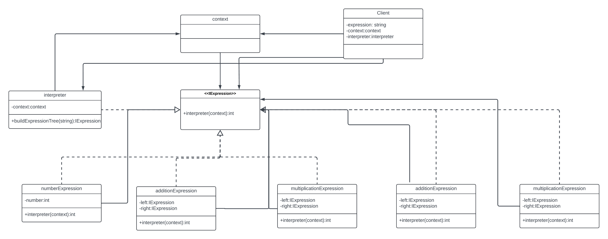

# Interpreter Pattern

The Interpreter Pattern is used to define a grammatical representation for a language and an interpreter to interpret the grammar. It is commonly used in SQL parsing, symbol processing engines, and more.

## Intent

The intent of the Interpreter Pattern is to:

- Define a representation for a language's grammar.
- Provide an interpreter that uses this representation to interpret sentences in the language.

## Structure

The key components of the Interpreter Pattern are:

- **AbstractExpression**: Declares an abstract `interpret` method that is common to all nodes in the abstract syntax tree.
- **TerminalExpression**: Implements an `interpret` method associated with terminal symbols in the grammar.
- **NonTerminalExpression**: Implements an `interpret` method associated with non-terminal symbols in the grammar. One such class is required for every rule in the grammar.
- **Context**: Contains information that's global to the interpreter.
- **Client**: The client is responsible for creating the abstract syntax tree (AST) and invoking the interpret() method on the root of the tree.
- **Interpreter**: The interpreter is responsible for coordinating the interpretation process.

## UML Diagram

## Example

Here is an example of the Interpreter Pattern implemented in C# which you can follow the code in current root.

## Benefits

- **Modularity** : Components such as terminal and non-terminal expressions can be easily added or modified to support new language constructs or operations.
- **Separation of Concerns**: The pattern separates the grammar interpretation from the client, allowing the client to focus on providing input expressions while leaving the interpretation logic to the interpreter components.
- **Extensibility**: New operations or language constructs can be added without modifying existing code, promoting code reuse and maintainability.

## Drawbacks

- Complex grammars are hard to maintain and can be inefficient.
- Interpreter pattern is best used for simple grammars.

## Related Patterns

- Composite Pattern: The abstract syntax tree is a Composite.
- Flyweight Pattern: The abstract syntax tree can use the Flyweight pattern to share nodes.
- Iterator Pattern: The interpreter can use an iterator to traverse the structure.

## References

- Design Patterns: Elements of Reusable Object-Oriented Software by Erich Gamma, Richard Helm, Ralph Johnson, and John Vlissides
- [Interpreter Design Pattern article in geeks for geeks.](https://www.geeksforgeeks.org/interpreter-design-pattern/)

## Contributing

We welcome contributions! If you have examples in different programming languages or improvements to existing ones, please fork the repository and create a pull request. Ensure to follow the contribution guidelines and maintain the folder structure.

## License

This project is licensed under the MIT License - see the [LICENSE](../../LICENSE) file for details.
